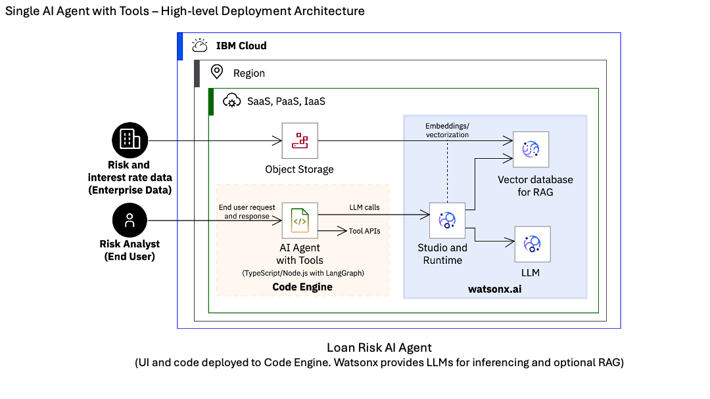
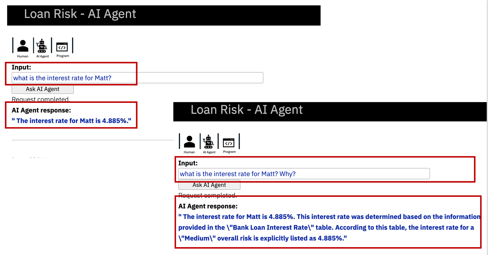

# Loan Risk - AI Agent

> Note: - Due to the deprecation of "mistral-large" on watsonx.ai in ~October 2025, this application now uses "ibm/granite-4-h-small" and does not perform as documented in this repository. It needs to be tested and updated further. See contact information below.

This repository provides an AI agent application for demonstration and proof-of-concept(PoC) to showcase agentic AI adoption in industry/enterprise workflows and use cases.

With a focus on the financial industry, it uses a bank loan processing workflow as an example that leverages agentic AI. It demonstrates one of the main values of using agentic AI - _relying on LLMs to reason about what to do and take actions_, instead of relying on traditional approach of rules and conditions. 

The application is built to run on IBM Cloud – deploy on Code Engine to host the code for the AI agent, use watsonx.ai for inferencing and retrieval augmented generation (RAG) with LLMs, and watsonx Assistant/Orchestrate for a chat conversation experience.

To learn more about the key features and architectural concepts of agentic AI and about using this Loan Risk AI Agent, you can: 

- Read the article [Agentic AI in enterprise workflow automation](https://developer.ibm.com/articles/agentic-ai-workflow-automation/).
- Watch the 5-minute demo video [Agentic AI on IBM Cloud - Demo](https://mediacenter.ibm.com/media/Agentic+AI+on+IBM+Cloud+-+Demo+Video/1_kn6kvqmz).

For questions or feedback contact Anuj Jain (jainanuj@us.ibm.com).

## Use Case
+ AI agent to support bank loan risk evaluation workflow.
+ AI agent determines overall risk and interest rate for a bank loan using LLMs and relevant tools.

Similar use cases can be found in insurance, healthcare and other industry/enterprise workflows.

## Architecture
+ Architecture: Single AI Agent with Tools (using LangGraph, TypeScript/NodeJS)
+ LLM: ibm/granite-4-h-small (from IBM watsonx.ai) (mistral-large is deprecated)
+ Tools: API/functions (for credit score, account status, risk evaluation criteria, interest rate determination)

#### Conceptual Architecture

#### High-level Deployment Architecture

## Deployment
#### Prerequisites
Requires IBM Cloud account with:
- watsonx.ai services
- Account user with administrative privileges for watsonx.ai, Code Engine, Container Registry
- Account user’s API key

Optional enhancements:

For using agentic RAG feature, you will also need watsonx.ai vector index and a deployed RAG inferencing endpoint. 

For using chat conversaiton feature, you will need watsonx Assistant/Orchestrate service.

Steps for deploying the base and enhancements are provided below.

#### Deployment options
- IBM Cloud Code Engine - Refer instructions [here.](artifacts/deployment/deployment-README.md)
- Python Notebook - A simplified version of this application can be set up as a Python Notebook (Code Engine deployment not required). Download from [here](artifacts/python-notebook/NB-ai-agent-loan-risk-demo-v1.ipynb) and import in watsonx.ai Project as an asset. It is meant for understanding the concepts and for experimentation.

## Usage
For usage and additional examples refer [here.](artifacts/usage-examples/usage-examples-README.md)

  

