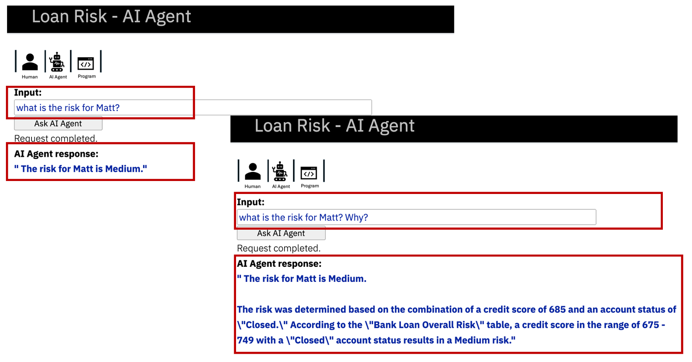
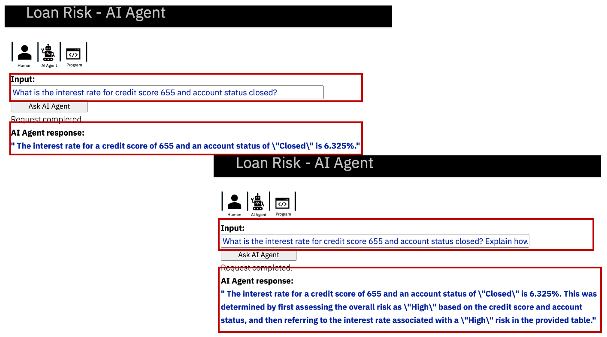
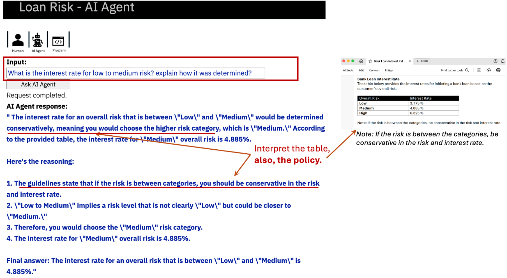

#### Usage flow:
To use the application (and for demo), you assume the persona of a human risk analyst from a bank. You interact with the Loan Risk AI agent to assess the risk and interest rate for customers. When requested, the Loan Risk AI agent interprets the question context, uses LLMs and information about the available tools to decide the logic and sequence for completing the request, and then acts on the information to complete the request. LLMs receive the questions and natural language prompt instructions from the AI agent, but there is no hardcoded traditional programming logic for interpretation or tool sequence to find the response.

#### Example questions to ask the Loan Risk AI Agent
Below are some examples of question to ask the Loan Risk AI Agent.

The code has predefined customers (Loren, Matt and Hilda) with specific risk profiles. The credit score and account status tool simulate API calls to return values for these customers.

+ what can you do for me?
+ what can you do for me? how?

+ what is the risk for loren? 
+ what is the risk for loren? why?

+ What is the interest rate for matt? 
+ What is the interest rate for matt? Explain how it was determined?
+ What is the interest rate for matt? why? how do you decide?

+ What is the credit score for hilda?

+ What is the credit score  and account status for hilda and matt?
+ What is the interest rate for credit score 655 and account status closed? why?
+ What is the risk with credit score 825 but account status delinquent? why?

+ What is the interest rate for low to medium risk?
+ What is the interest rate for low to medium risk? why?

+ How do you determine the interest rate from overall risk? Explain.

Example screenshots:

Example 1:

Example 2:

Example 3:

Example 4:
